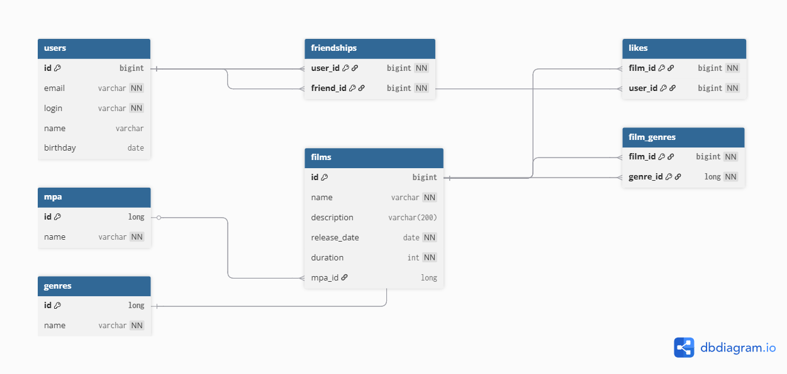

# java-filmorate
## Database schema



### Schema description

The database schema is designed in 3rd Normal Form (3NF) and supports all business requirements of the application:

- Users and films are stored in separate tables.
- Films can have multiple genres (many-to-many relationship).
- Each film has an MPA rating.
- Users can like films (one user — one like per film).
- Friendship between users supports two states: `PENDING` and `CONFIRMED`.

All many-to-many relationships are implemented via junction tables.

### Example SQL queries

**Top 10 most popular films by number of likes**
```sql
SELECT f.*
FROM films f
LEFT JOIN likes l ON f.id = l.film_id
GROUP BY f.id
ORDER BY COUNT(l.user_id) DESC
LIMIT 10;
```

**Get all friends of a user**
```sql
SELECT u.*
FROM users u
JOIN friendships f ON u.id = f.friend_id
WHERE f.user_id = ? AND f.status = 'CONFIRMED';
```

**Get common friends of two users**
```sql
SELECT u.*
FROM users u
JOIN friendships f1 ON u.id = f1.friend_id
JOIN friendships f2 ON u.id = f2.friend_id
WHERE f1.user_id = ?
  AND f2.user_id = ?
  AND f1.status = 'CONFIRMED'
  AND f2.status = 'CONFIRMED';
```

**Get all genres of a film**
```sql
SELECT g.*
FROM genres g
JOIN film_genres fg ON g.id = fg.genre_id
WHERE fg.film_id = ?;
```


